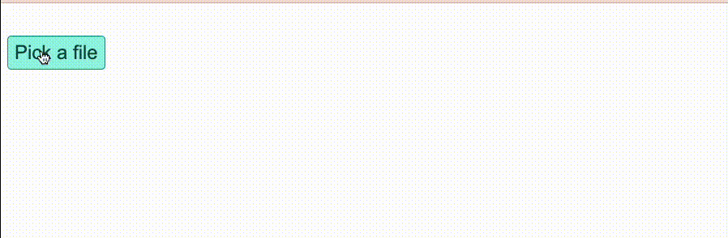
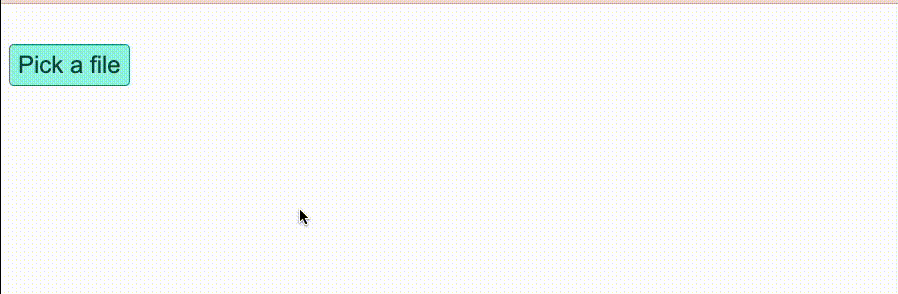
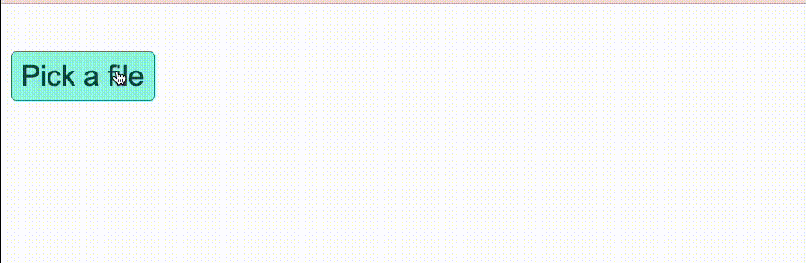
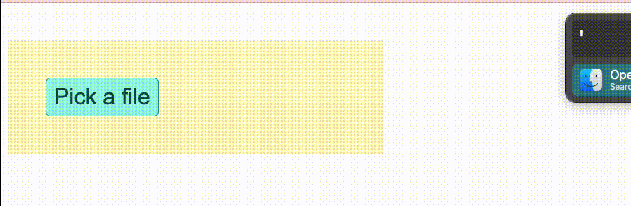

<p align="center">
  <h1 align="center">&lt;mux-uploader/&gt;</h1>
  <a href="https://npmcharts.com/compare/@mux/mux-uploader?interval=30"></a>
    <a href="https://www.npmjs.com/package/@mux/mux-uploader"></a>
    <a href="https://www.npmjs.com/package/@mux/mux-uploader"></a>
</p>

# Introduction

`<mux-uploader>` is web component for uploading files to Mux.

`<mux-uploader-drop>` is an optional supporting container-style web component for drag and drop. You can always configure your own drag and drop with `<mux-uploader>`.

If you are looking for a direct upload interface and a progress bar, you're in the right place.

# Installation

If you're using `npm` or `yarn`, install that way:

## Package manager

```
yarn add @mux/mux-uploader
```

or

```
npm i @mux/mux-uploader
```

Then, import the library into your application with either `import` or `require`:

```js
import '@mux/mux-uploader';
```

or

```js
require('@mux/mux-uploader');
```

## CDN option

Alternatively, use the CDN hosted version of this package:

```html
<script src="https://unpkg.com/@mux/mux-uploader"></script>
```

If you are using ECMAScript modules, you can also load the `mux-uploader.mjs` file with `type=module`:

```html
<script type="module" src="https://unpkg.com/@mux/mux-uploader/dist/mux-uploader.mjs"></script>
```

# Usage

In these examples, you will replace the value of the `endpoint` property with the the response returned from [creating a Direct Upload](https://docs.mux.com/api-reference/video#operation/create-direct-upload). Creating a direct upload happens server-side directly to the Mux API.

The URL for a Direct Upload looks like `"https://storage.googleapis.com/video..."`.

## Quickstart

This will show:

- An upload button
- When a file is selected a progress bar will shows the upload progress
- With the `status` attribute, the upload progress will also show the status of the upload (by default is a number percentage).

```html
<mux-uploader endpoint="https://my-authenticated-url/storage?your-url-params" status></mux-uploader>
```


## Customizing

The default uploader looks nice out of the box, but it probably isn't exactly the look you're going for in your application.

### Using your own button

You can use your own button with the `slot="upload-button"` attribute.

This is really handy if, for example, you already have a `.btn` class that styles buttons in your application.

```html
<style>
  .btn {
    /* your styles for .btn */
    padding: 6px 8px;
    border: 1px solid #0d9488;
    border-radius: 5px;
    font-size: 24px;
    color: #134e4a;
    background: #99f6e4;
    cursor: pointer;
  }
</style>

<!-- slot="upload-button" is doing the magic here -->
<mux-uploader endpoint="https://my-authenticated-url/storage?your-url-params" status>
  <button class="btn" type="button" slot="upload-button">Pick a file</button>
</mux-uploader>
```



### Customizing the progress bar

By default, the progress bar color is black with a gray background, you can customize that with css vars. For example, if you want to make the progress bar purple, you can do this:

```html
<style>
  mux-uploader {
    --progress-bar-fill-color: #7e22ce;
  }
</style>

<mux-uploader endpoint="https://my-authenticated-url/storage?your-url-params" status>
  <button class="btn" type="button" slot="upload-button">Pick a file</button>
</mux-uploader>
```



### Customizing the status text

By default the status text shows a percentage. If you want to center the status text and increase the font size, you can do that by applying styles to the `mux-uploader` component itself.

```html
<style>
  mux-uploader {
    --progress-bar-fill-color: #7e22ce;
    font-size: 22px;
    font-family: monospace;
    text-align: center;
  }
</style>

<mux-uploader endpoint="https://my-authenticated-url/storage?your-url-params" status>
  <button class="btn" type="button" slot="upload-button">Pick a file</button>
</mux-uploader>
```



## Fetching the upload URL async

In the examples above, the `endpoint` attribute is an authenticated URL for a Mux [Direct Upload](https://docs.mux.com/api-reference/video#operation/create-direct-upload).

At the time you render the `<mux-uploader>`, you may not have the direct upload URL yet, so it helps to fetch that async from your server after a user selects a file.

```html
<mux-uploader status></mux-uploader>

<script>
  const muxUploader = document.querySelector('mux-uploader');
  /*
    Endpoint should be a function that returns a promise and resolves
    with a string for the upload URL.
  */
  muxUploader.endpoint = function () {
    /*
      In this example, the server endpoint will return the upload URL
      in the response body "https://storage.googleapis.com/video..."
    */
    return fetch('/your-server/api/create-upload').then((resp) => {
      return resp.text();
    });
  };
</script>
```

## Drag and Drop

`<mux-uploader-drop>` is available for drag and drop functionality. It works like a `<div>` or other "container" element in the sense that you can style it and populate it with whatever children you see fit (including but not necessarily a `<mux-uploader>`).

Similar to `<input>` and `<label>` relationships, you associate a `<mux-uploader-drop>` with its corresponding `<mux-uploader>` via `id` using the `mux-uploader` attribute.

The `<mux-uploader-drop>` component will get the `active` attribute when the drag is active, this allows you to write some CSS to style it for your application.

Here's a full example of a custom button, customized progress text and drag and drop functionality that changes the background when the drag is active

```html
<style>
  /* This .btn class styles buttons in my application */
  .btn {
    padding: 6px 8px;
    border: 1px solid #0d9488;
    border-radius: 5px;
    font-size: 24px;
    color: #134e4a;
    background: #99f6e4;
    cursor: pointer;
  }
  /* Customize progress bar color & status text position & sizing */
  mux-uploader {
    --progress-bar-fill-color: #7e22ce;
    font-family: monospace;
    font-size: 22px;
    text-align: center;
  }
  /* Customize drop area background color & active background color */
  mux-uploader-drop {
    display: block;
    padding: 40px;
    background: #fef9c3;
  }
  mux-uploader-drop[active] {
    background: #ffe4e6;
  }
</style>

<mux-uploader-drop mux-uploader="my-uploader">
  <mux-uploader id="my-uploader" status endpoint="https://my-authenticated-url/storage?your-url-params">
    <button class="btn" type="button" slot="upload-button">Pick a file</button>
  </mux-uploader>
</mux-uploader-drop>
```



**Technical details about drop areas:**

When a file is dropped, this will dispatch a custom `file-ready` event to the corresponding `<mux-uploader>` with the relevant file.

You can implement your own drag and drop completely separate from `<mux-uploader>` and as long as you dispatch a custom `file-ready` with the file in the `detail` property then `<mux-uploader>` will handle the upload upon receiving the event.

```html
<script>
  const muxUploader = document.querySelector('mux-uploader');

  // Dispatch custom event to trigger upload
  muxUploader.dispatchEvent(
    new CustomEvent('file-ready', {
      composed: true,
      bubbles: true,
      detail: file,
    })
  );
</script>
```

## Handling events

When the upload is complete, you'll see 100% on the progress bar and the `success` event will fire.

If an error happens during the upload, `uploaderror` will fire.

```html
<mux-uploader endpoint="https://my-authenticated-url/storage?your-url-params" status></mux-uploader>

<script>
  const muxUploader = document.querySelector('mux-uploader');
  muxUploader.addEventListener('success', function () {
    /* Handle upload success */
  });

    muxUploader.addEventListener('uploaderror', function () {
    /* Handle upload error */
  });
<script>
```

### Attributes

#### `<mux-uploader>`

| Attribute            | Type                | Description                                                                                                                                                                                                                                                                           | Default     |
| -------------------- | ------------------- | ------------------------------------------------------------------------------------------------------------------------------------------------------------------------------------------------------------------------------------------------------------------------------------- | ----------- |
| `endpoint`           | `string \| Promise` | Either a) the authenticated URL that your file will be uploaded to or b) an async function that yields a promise that resolves to that url. Check out the [direct uploads docs](https://docs.mux.com/guides/video/upload-files-directly#1-create-an-authenticated-mux-url). Required. | `undefined` |
| `id`                 | `string`            | An ID that allows `mux-uploader-drop` to locate `mux-uploader`. Required if you use `mux-uploader-drop`.                                                                                                                                                                              | N/A         |
| `upload-in-progress` | `boolean`           | (Read-only) Toggles visual status of progress bar while upload is in progress. Can be targeted with CSS if you want to control styles while in progress i.e. mux-uploader[upload-in-progress].                                                                                        | false       |
| `upload-error`       | `boolean`           | (Read-only) Toggles visual status of progress bar when upload encounters an error. Can be targeted with CSS if you want to control styles when an error occurs i.e. mux-uploader[upload-error].                                                                                       | false       |
| `status`             | `boolean`           | Toggles text status visibility of progress bar. The text that is displayed is a percentage by default. If you prefer just the progress bar with no text upload status, don't include this attribute.                                                                                  | false       |
| `dynamic-chunk-size` | `boolean`           | Toggles uploading with dynamic chunk sizes. Chunk sizes will change with upload speed to attempt to optimize upload.                                                                                                                                                                  | false       |

---

#### `<mux-uploader-drop>`

| Attribute      | Type      | Description                                                | Default |
| -------------- | --------- | ---------------------------------------------------------- | ------- |
| `overlay`      | `boolean` | Toggles showing an overlay on dragover.                    | `false` |
| `overlay-text` | `string`  | Optional text to display on dragover when `overlay` is on. | `''`    |
| `mux-uploader` | `string ` | Must match the `id` on `MuxUploader`. Required.            | N/A     |

### Properties

#### `<mux-uploader>`

| Property         | Type       | Description                                                                                                                                                                                                                                                                                        | Default                                                          |
| ---------------- | ---------- | -------------------------------------------------------------------------------------------------------------------------------------------------------------------------------------------------------------------------------------------------------------------------------------------------- | ---------------------------------------------------------------- |
| `formatProgress` | `function` | A function that accepts numeric percent and is expected to return a string. Allows for customizing how the progress should be rendered - whether you want to display only the number or a sentence with the number etc. i.e. `formatProgress={(percent: number) => `${percent} percent uploaded`}` | A function that yields only the percent as a string i.e. `"60%"` |

### Events

#### `<mux-uploader>`

`<mux-uploader>` has a handful of events - using [Upchunk](https://github.com/muxinc/upchunk/blob/master/README.md) under the hood - to monitor uploading state.

| Event          | Description                                                                                                                                                        |
| -------------- | ------------------------------------------------------------------------------------------------------------------------------------------------------------------ |
| `uploadstart`  | Fired when the upload begins.                                                                                                                                      |
| `chunkattempt` | Fired immediately before a chunk upload is attempted.                                                                                                              |
| `chunksuccess` | Fired when an indvidual chunk is successfully uploaded. Sample response: `{ detail: { chunk: Integer, attempts: Integer, response: XhrResponse } }`                |
| `uploaderror`  | Fired when an error occurs in the chunked upload process.                                                                                                          |
| `progress`     | Fired continuously with incremental upload progress. This returns the current percentage of the file that's been uploaded. Sample response: `{ detail: [0..100] }` |
| `success`      | Fired when the entire file has successfully completed uploading.                                                                                                   |

### Styling

`<mux-uploader>` and `<mux-uploader-drop>` can be styled with standard CSS, but also includes these CSS variables for "under the hood" styling.

#### `<mux-uploader>`

| Name                           | CSS Property       | Default Value       | Description                                             | Notes                                                                                             |
| ------------------------------ | ------------------ | ------------------- | ------------------------------------------------------- | ------------------------------------------------------------------------------------------------- |
| `--uploader-font-family`       | `font-family`      | `Arial`             | font family of the component                            | Applies to other elements as well: upload status and error status                                 |
| `--uploader-font-size`         | `font-size`        | `16px`              | font size for text within the component                 | Also applies to `<mux-uploader-drop>` i.e. overlay text                                           |
| `--uploader-background-color`  | `background-color` | `inherit`           | background color of area surrounding the upload         |                                                                                                   |
| `--button-background-color`    | `background`       | `#fff`              | background color of upload button                       |                                                                                                   |
| `--button-border-radius`       | `border-radius`    | `4px`               | border radius of the upload button                      |                                                                                                   |
| `--button-border`              | `border`           | `1px solid #000000` | border of the upload button                             |                                                                                                   |
| `--button-padding`             | `padding`          | `16px 24px`         | padding of the upload button                            |                                                                                                   |
| `--button-hover-text`          | `color`            | `#fff`              | text color of upload button on button hover             |                                                                                                   |
| `--button-hover-background`    | `background`       | `#404040`           | background color of upload button on button hover       |                                                                                                   |
| `--button-active-text`         | `color`            | `#fff`              | color of upload button text when button is active       |                                                                                                   |
| `--button-active-background`   | `background`       | `#000000`           | background color of upload button when button is active | Applied via `:active` [pseudo selector](https://developer.mozilla.org/en-US/docs/Web/CSS/:active) |
| `--progress-bar-fill-color`    | `background`       | `#000000`           | background color for progress bar div                   |                                                                                                   |
| `--progress-radial-fill-color` | `stroke`           | `black`             | stroke color for circle SVG (wip)                       |                                                                                                   |

#### `<mux-uploader-drop/>`

| Name                         | CSS Property       | Default Value               | Description                         | Notes                                                  |
| ---------------------------- | ------------------ | --------------------------- | ----------------------------------- | ------------------------------------------------------ |
| `--overlay-background-color` | `background-color` | `rgba(226, 253, 255, 0.95)` | background color of the overlay div | Visible only when component has `fullscreen` attribute |
